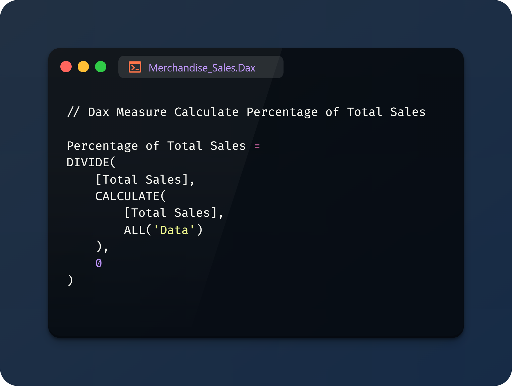

# Merchandise Analysis

 

## 1. Introduction  
Lee Chatmen, a renowned influencer with over 7 million TikTok followers, gained popularity through his captivating performances of popular songs on miniature guitars. Building on his fame, he launched a line of merchandise in 2023 to capitalize on his brand and loyal fan base. However, entering the merchandise market comes with its own challenges, including understanding consumer preferences, identifying high-performing products, and optimizing sales strategies.  

Analyzing sales data is essential for uncovering patterns, addressing customer needs, and making data-driven decisions. This project focuses on leveraging **Power BI** to analyze merchandise sales data, providing valuable insights into sales trends, product performance, and customer behavior. The analysis ultimately aims to drive growth and refine business strategies based on evidence-backed recommendations.  

## 2. Problem Statement  
Lee Chatmen is a popular influencer from the United States with a strong social media presence. After launching his merchandise line in 2023, understanding its sales performance became critical for sustaining and expanding his business. This analysis aims to address the following key questions:  

- What are the overall trends in sales performance over time?  
- Which product categories and individual items perform the best and worst?  
- How do regional factors influence sales?  
- What is the impact of customer demographics on purchasing patterns?  
- How can customer feedback and ratings guide future strategies?  

This problem statement emphasizes the need for a systematic approach to transform raw sales data into actionable insights, ensuring informed decision-making and sustainable growth for the merchandise business.
  
## 3. Skills Demonstrated   
- **Business Intelligence**: Leveraging Power BI for dynamic dashboards and reports.  
- **Data Visualization**: Creating clear, interactive, and impactful visualizations to communicate insights effectively.
- **Dynamic KPI Card**: Implementing Reference Labels that dynamically adjust between "PY" (Previous Year) or "PM" (Previous Month) formats to provide contextual insights into sales comparisons.  
- **Power Query**: Using Power Query to clean, transform, and shape raw data into an analysis-ready format, ensuring accuracy and consistency.  
- **Advance DAX Measure**: Creating custom DAX (Data Analysis Expressions) measures for create column, advanced calculations, such as percentage changes, cumulative totals, and correlations between ratings and sales.  
- **Word Cloud**: Visualizing frequently occurring words in customer feedback to better understand sentiments and identify common themes in positive and negative reviews.
- **Analytical Thinking**: Deriving actionable insights from data to support decision-making.  

## 4. Data Sourcing  
The dataset used in this analysis includes:  
- Monthly sales data from November 2023 to October 2024.  
- Information on product categories, sales revenue, and customer ratings.  
- Regional sales data across multiple cities and countries.  
- Customer demographics, including age groups and gender.

The Dataset Provide by **Onyx Data** 

More Information About This Challenge: [Onyx Data January 2025 challenge](https://zoomcharts.com/en/microsoft-power-bi-custom-visuals/challenges/onyx-data-january-2025)

## 5. Data Transformation  
The following transformations were performed within **Power BI**:  
- **Data Cleaning**: Removing missing or inconsistent data entries.  
- **Power Query**: Using Power Query to clean, transform, and shape raw data into an analysis-ready format, ensuring accuracy and consistency.  
  - Replacing specific values in a column to ensure standardization.  
    

    

  | Before | After |
  |----------|----------|
  |  |  |

- **Custom Calculations**: Creating measures and calculated columns (e.g., total sales, percentage contribution, ratings impact, and more).  
  - Calculate Total

    

  - Calculate Average

     
 
  - Percentage Contribution

    

  - Calculate Ranking

    

- **Dynamic Reference Label**: Leveraging dynamic labels to automatically adjust for "Previous Year (PY)" or "Previous Month (PM)" references, ensuring clear comparison metrics.
  - Sales 
  
     

  - QTY Sold 
  
     

  - Order Count 
  
     

  - Shipping Charges 
  
     
 
- **Segmentation**: Grouping data by product category, location, and customer demographics.  

## 6. Modeling  
The project utilized Power BI’s built-in capabilities for data modeling and analysis, including:  
- Time-series analysis to identify monthly sales trends.  
- Performance comparisons between product categories and individual products.  
- Regional sales breakdown to highlight high-performing and low-performing locations.  
- Analyzing customer feedback and its correlation with product sales.  
- **Conditional Formatting**: Applied color coding to highlight trends in sales performance, customer feedback, and other key metrics.  
  - Sales 
  
     

  - QTY Sold 
  
     

  - Order Count 
  
     

  - Shipping Charges 
  
    
 
- **Deep Analysis Column**: Custom columns were created to uncover deeper insights into specific data dimensions, such as advanced segmentation or product performance metrics and more.  
   - Sentiment 
  
    | Dax | Result |
    |----------|----------|
    |  |  | 

  - Age Group
  
    | Dax | Result |
    |----------|----------|
    |  |  | 

  - Charges Category
  
    | Dax | Result |
    |----------|----------|
    |  |  | 

  - Region
  
    | Dax | Result |
    |----------|----------|
    |  |  | 

  - Price Category
  
    | Dax | Result |
    |----------|----------|
    |  |  | 

  - Review Length
  
    | Dax | Result |
    |----------|----------|
    |  |  |    

## 7. Analyze & Visualization  
The analysis was conducted entirely in **Power BI**, leveraging its visualization tools to create the following:  
- **Trend Analysis**: Line charts to display monthly sales performance.  
- **Category Performance**: Bar charts and pie charts to compare product categories.  
- **Regional Heatmaps**: Visualizing sales by geographic location.  
- **Customer Insights**: Demographic breakdowns and feedback analysis.  
- **Interactive Dashboards**: Allowing users to filter data by category, region, and time period for deeper insights. 

### Insights : 
#### Overall Sales Trends  
- Sales have steadily increased from **November 2023 to October 2024**, with a significant peak observed in **May 2024**.  
- A slight decline followed the peak, indicating possible seasonal trends.  
- **International sales** contributed significantly but remained slightly lower than local sales.  

#### Product Categories Performance  
- **Clothing** dominates as the top-performing category with **6.10K units sold**, making it the largest revenue contributor.  
- **Ornaments** rank second with **3.77K units sold**, while the **Other** category performed the lowest with **2.47K units sold**.  
- The top five revenue-generating positions are occupied exclusively by clothing products, underscoring its popularity.  
- Clothing is clearly the most preferred category, while **Ornaments** and **Other** categories show room for growth with targeted strategies.  

#### Most and Least Popular Products  
- **Most Popular Product:** BF1548 (**Clothing**) contributes **22.26% of total sales** and generates **$190,640** in revenue.  
- **Second Best-Selling Product:** BF1543 (**Clothing**) contributes **16.86% of total sales** and generates **$144,395** in revenue.  
- **Least Popular Product:** BF1555 (**Other**) contributes only **1.01% of total sales**, generating **$8,666** in revenue.  
- Top-selling products tend to have higher average ratings of **3.50+**, highlighting the link between quality and sales.  

#### Location Impact on Sales  
- Top-performing cities include:  
  - **San Francisco**: 746 units sold  
  - **Sacramento**: 719 units sold  
  - **New Jersey**: 692 units sold  
  - **New York**: 689 units sold  
- Sales are predominantly higher in **urban areas**, such as San Francisco and New York.  
- **Toronto** and **Montreal** showed lower contributions, suggesting the need for tailored strategies in these regions.  

#### Impact of International Shipping on Sales  
- **International shipping** constitutes a significant portion of total sales.  
- However, high shipping costs negatively affect purchasing decisions, highlighting the need for potential cost reduction or incentives for international buyers.  

#### Demographic Profile of Buyers  
- The **largest consumer segment** comprises **young adults aged 21-29**, followed by adults, with teenagers making up the smallest but notable group.  
- A higher proportion of buyers are male, presenting a focused demographic for marketing campaigns.  

#### Ratings and Reviews Correlation with Sales  
- Products with higher ratings (**3.50+**) tend to perform better, demonstrating the importance of quality and positive customer feedback.  
- Keywords such as **"quality"**, **"appreciated"**, and **"design"** frequently appear in positive reviews, while terms like **"unfortunately"** and **"poor"** are common in negative reviews.     

## Conclusion  
The analysis of Lee Chatmen's merchandise sales provides the following key takeaways:  

1. **Steady Sales Growth with Seasonal Trends:**  
   Sales show an overall upward trend from November 2023 to October 2024, with a peak in May 2024. Seasonal patterns and external factors likely contribute to this growth and subsequent decline.  

2. **Clothing as a Dominant Category:**  
   Clothing products are the clear leaders in both sales and revenue, outperforming Ornaments and Other categories. This highlights a strong customer preference for clothing merchandise.  

3. **Product-Specific Insights:**  
   BF1548 and BF1543 dominate sales, while BF1555 (Other category) underperforms. Top-selling products consistently align with higher customer ratings, emphasizing the importance of quality.  

4. **Urban and Regional Sales Concentration:**  
   Urban regions, especially San Francisco, Sacramento, New Jersey, and New York, generate the highest sales. Meanwhile, international sales contribute significantly but face challenges due to higher shipping costs.  

5. **Demographic and Customer Behavior:**  
   Young adults (aged 21-29) form the largest consumer segment, with a higher proportion of male buyers. Positive product ratings and customer feedback correlate strongly with increased sales.  

---

## Recommendations  

1. **Leverage Seasonal Sales Opportunities:**  
   Investigate factors behind the May 2024 sales peak to replicate success in future campaigns. Utilize promotional offers or new launches during peak sales months to sustain momentum.  

2. **Expand Clothing Merchandise Offerings:**  
   Introduce more designs and product variations within the clothing category to capitalize on its popularity.  

3. **Revive Underperforming Products:**  
   Analyze feedback and rework products like BF1555 to improve their appeal. Consider bundling or discounts for low-performing categories.  

4. **Optimize Regional Marketing Strategies:**  
   Focus marketing efforts on top-performing urban areas like San Francisco and New York. Develop localized strategies for underperforming cities, such as Toronto and Montreal, to unlock potential growth.  

5. **Address International Shipping Costs:**  
   Implement cost-sharing measures, free shipping thresholds, or localized warehouses to make international shipping more attractive.  

6. **Target Young Adult Demographics:**  
   Design campaigns tailored to young adults, highlighting trends and social media engagement to reach this primary audience effectively.  

7. **Emphasize Product Quality:**  
   Maintain high product ratings by addressing customer feedback promptly. Highlight customer reviews in marketing materials to build trust and credibility.  

8. **Invest in Review Analysis:**  
   Continue analyzing customer reviews for actionable insights. Identify patterns in sentiment to address concerns and improve customer satisfaction.    

---  

### Repository Contents  
- **Power BI Dashboard File**: The main [PBIX File]() containing the analysis and visualizations. 
- **Data Sources**: [Raw Dataset](Merchandise_Sales_Analysis.xlsx) used in the project.  
- **Screenshots/Reports**: Exported visualizations for sharing insights.  
- **README.md**: Project documentation (this file).  

